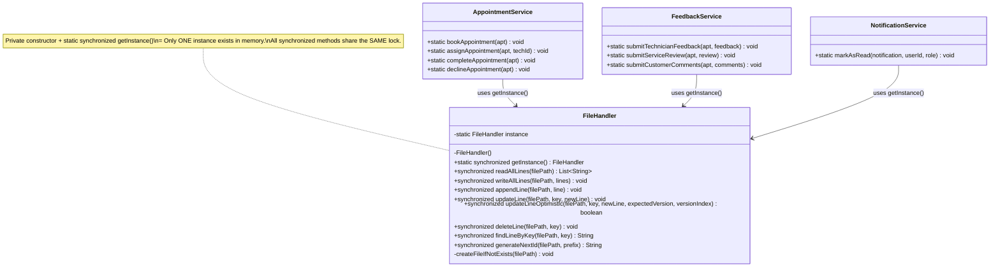
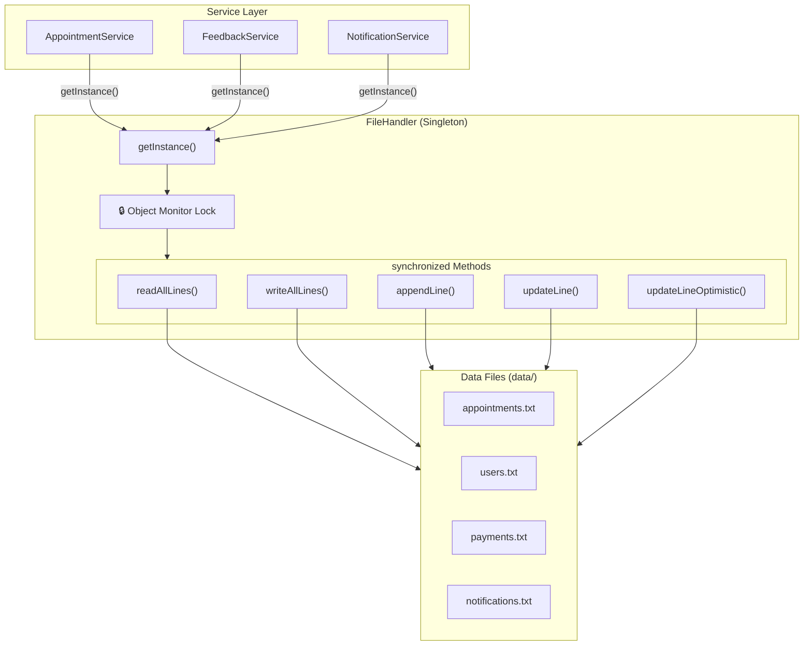
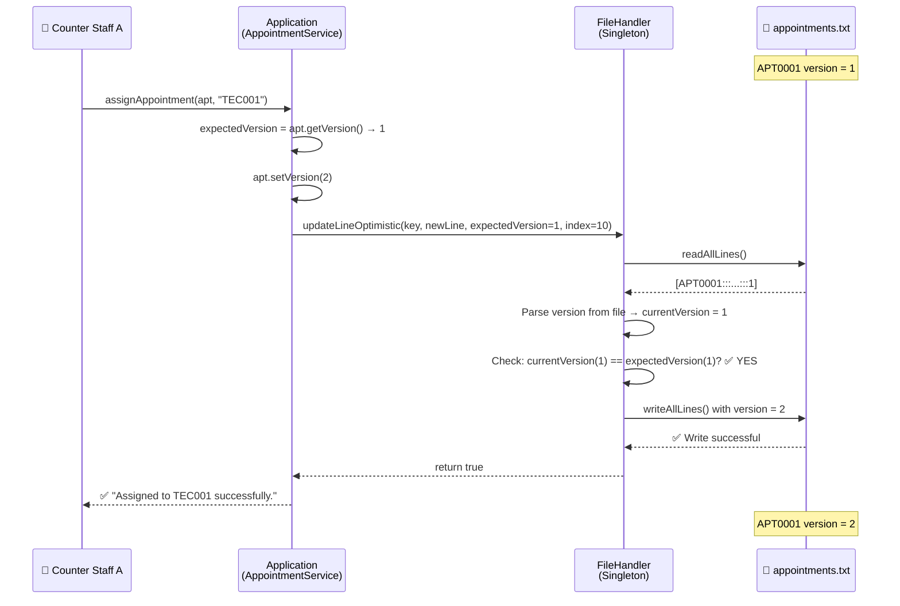
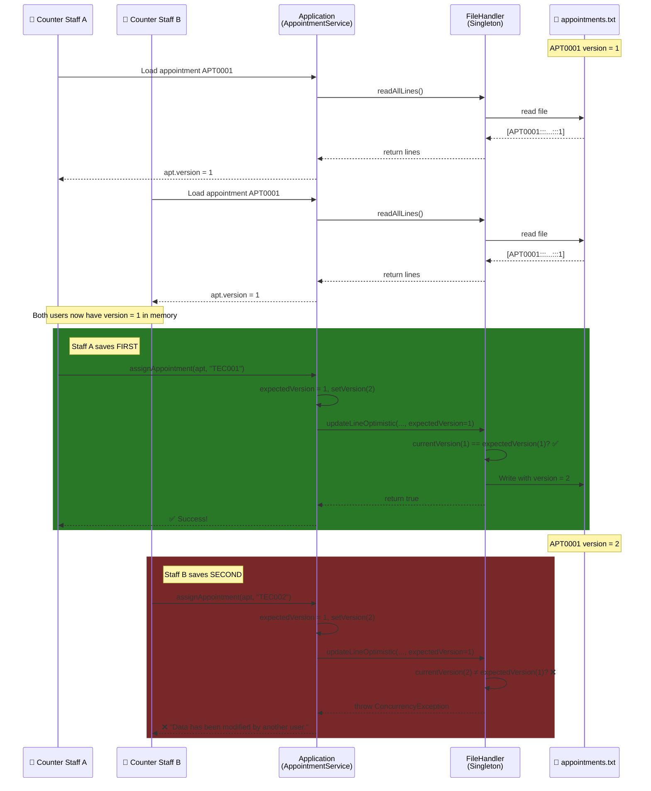
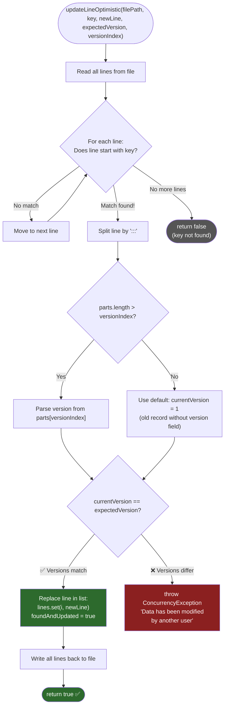

# Singleton + Optimistic Locking Architecture

## 1. Singleton Pattern — Class Diagram

Shows how `FileHandler` enforces a single shared instance across the entire application.

---

## 2. Singleton Access — All Services Share One Lock

---

## 3. Optimistic Locking — Success Scenario (Sequence Diagram)

Two users load the same appointment, but **User A saves first** and succeeds. User B also succeeds because they save a different appointment.

---

## 4. Optimistic Locking — Conflict Scenario (Sequence Diagram)

Two users load the same appointment **at the same time**. User A saves first. When User B tries to save, the version has changed — **conflict detected!**

---

## 5. updateLineOptimistic — Internal Flowchart

---

## Summary

| Design Pattern | Where | Purpose |
|---|---|---|
| **Singleton** | `FileHandler.getInstance()` | Guarantees only ONE object manages all file I/O, so all `synchronized` methods share the same lock |
| **Coarse-Grained Locking** | All `synchronized` methods in `FileHandler` | Prevents physical file corruption by forcing threads to take turns at the I/O level |
| **Optimistic Locking** | `updateLineOptimistic()` | Detects when two users try to edit the same record, preventing the "Lost Update" problem without blocking users from working in parallel |

---

## 6. Why Do We Need These? (The Problem & The Solution)

Understanding *why* these patterns are used is just as important as knowing how they work. Here is a breakdown of what issues they solve and what happens if you skip them.

### 6.1. The Singleton Pattern & Synchronization
**The Issue it Solves:** Physical File Corruption when multiple parts of the app try to use the hard drive at the same time.

**What Happens If We Don't Have It? (Likely Crash or Corruption):**
If two different parts of your system try to save to `appointments.txt` at the exact same millisecond:
* **The Crash:** Java might throw an error and crash (e.g., "The process cannot access the file because it is being used by another process").
* **The Corruption:** Sometimes it doesn't crash, but both saves write to the file at the exact same time. The text file ends up looking like gibberish (e.g., half of one line merged with another). Your system is now permanently broken because it cannot read the data files anymore.

**How It Solves the Issue (The "Exact Same Microsecond" Scenario):** 
* **Singleton:** Ensures there is only *one* `FileHandler` object. All threads are forced to use this single object.
* **`synchronized` (The Lock):** If User A and User B click "Save" at the **exact same microsecond**, they both arrive at the `FileHandler` at the same time. The `synchronized` keyword acts as a physical lock on the door. It forces a tiny race at the CPU level. 
  * User A wins the lock by a nanosecond and goes inside to save.
  * User B does **not** crash. Java simply forces User B to wait outside the locked door.
  * When User A finishes and exits, the door unlocks. User B is then allowed inside to do their save safely.

### 6.2. Optimistic Locking
**The Issue it Solves:** The "Lost Update" Problem (Silent Data Loss). This happens when two users open the same record, both make changes, and both save.

**What Happens If We Don't Have It? (Silent Data Loss):**
This is extremely dangerous because the system *looks* like it's working perfectly fine and never crashes.
* Staff A and Staff B load Appointment #001 at the same time.
* Staff A assigns it to Technician X and saves.
* A second later, Staff B assigns it to Technician Y and saves.
* **Result:** Staff B just silently wiped out Staff A's work. The system continues running happily, but your business data is now wrong. You won't know there is a problem until an angry customer complains.

**How It Solves the Issue (The "Exact Same Microsecond" Scenario):** 
It adds a `version` number to every line in the text file (e.g., `APT001:::...:::version=1`).
If Staff A and Staff B loaded **version 1** on their screens, and both click "Save" at the **exact same microsecond**:
1. Because `updateLineOptimistic` is a `synchronized` method, they are forced to line up at the locked door (as explained in 6.1). 
2. **Staff A wins the lock:** Staff A goes inside, sees the file is still at version 1, successfully saves their changes, updates the file to **version 2**, and leaves.
3. **Staff B's turn:** The door unlocks and Staff B goes inside. Staff B says, *"I want to update version 1."*
4. The system checks the file and says: *"Wait, the file is already at version 2 now! If I let you save, you will overwrite Staff A's work."* 
5. Instead of overwriting the data, it stops Staff B and shows an error: *"Data has been modified by another user."*

*(Notice how Singleton prevents them from crashing the file, and Optimistic Locking prevents them from deleting each other's data!)*
